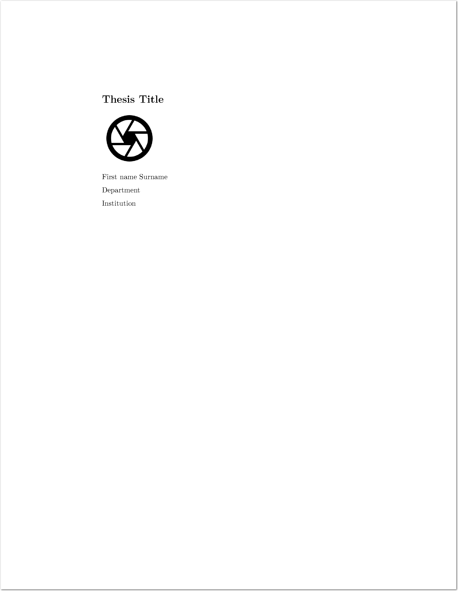
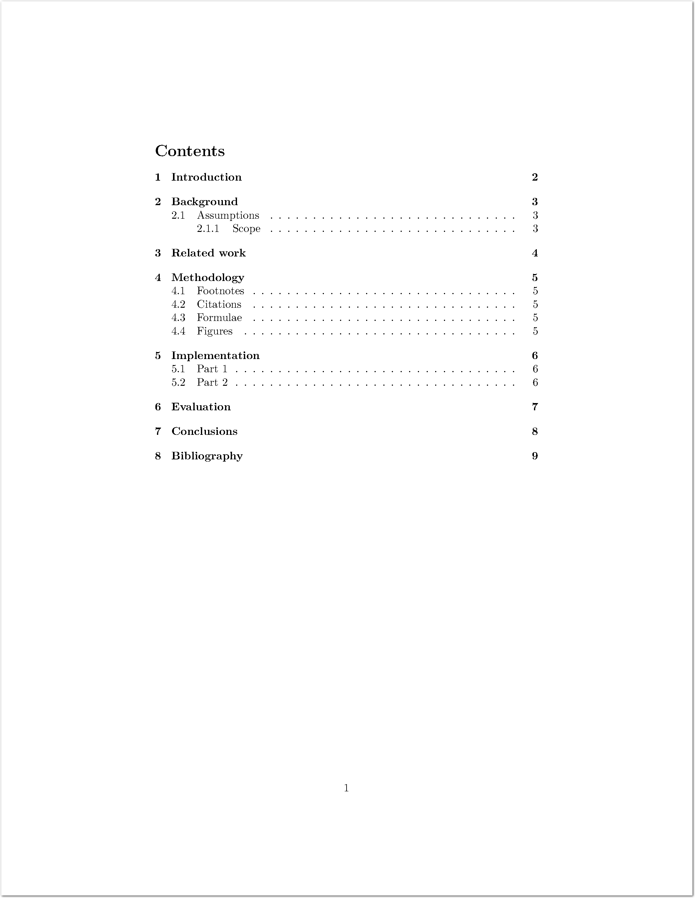
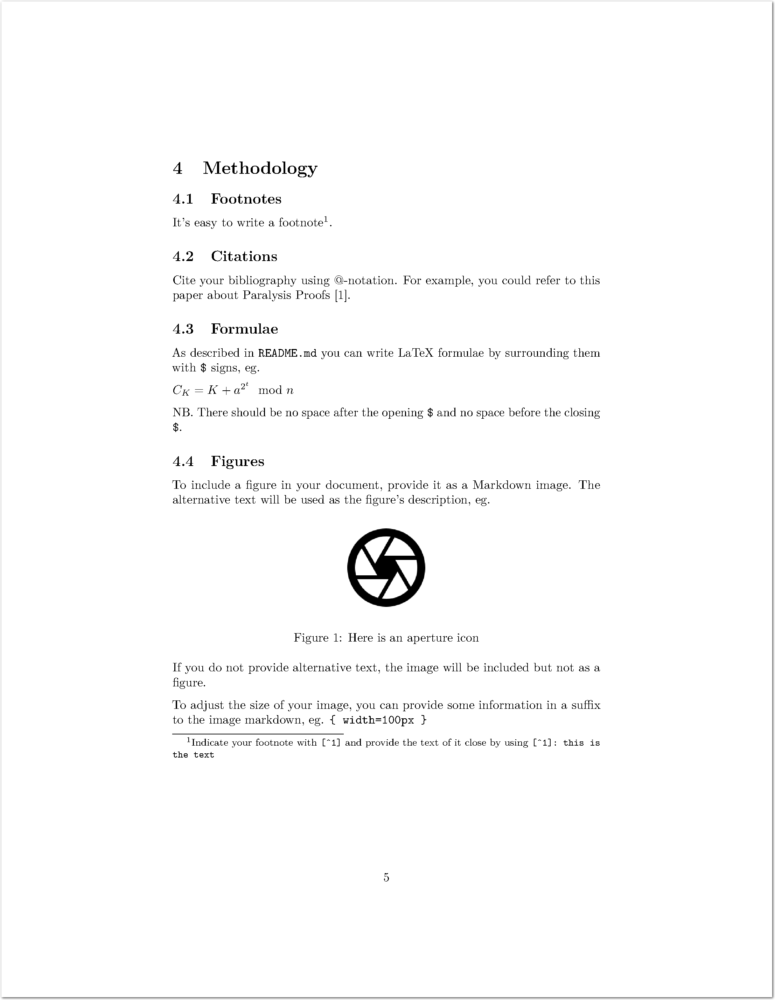
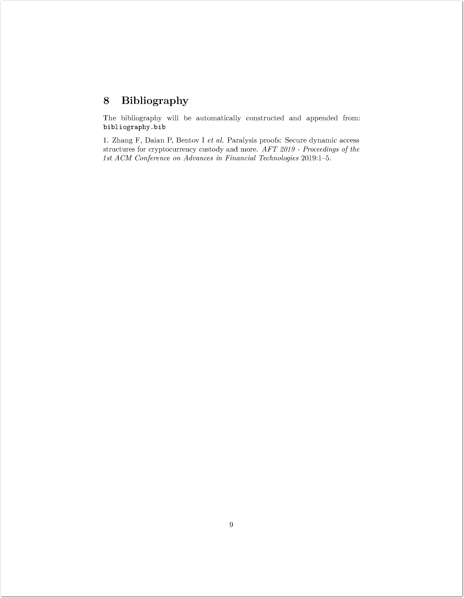

# Template thesis

> The things I'll do to avoid learning LaTeX.

This is a template for building a thesis PDF that's written in markdown, using features and styles from LaTeX.

* Runs in a Docker container for portability.
* Allows you to write primarily in Markdown for simplicity.

Markdown is easy to write, and will help you to write the bulk of your document. This project supports a few additional features you may also need:

* Includes support for a cover page (not numbered).
* Includes support for building a table of contents.
* Numbers the various main sections of the document.
* Includes support for LaTeX mathematics / formulae.
* Includes support for citations, and a BibTex bibliography.

The whole document is built from source markdown files using a Docker container that contains everything it needs. The output is a PDF document.

## Prerequisites

The build takes place in a [Docker](https://www.docker.com/) container.

Instructions for installing Docker are available below for OS X. Feel free to submit a PR with extra information for other systems.

### OS X

On OS X, you can install Docker Desktop using [homebrew](https://brew.sh/).

1. Install homebrew:
   
   ```bash
   /bin/bash -c "$(curl -fsSL https://raw.githubusercontent.com/Homebrew/install/HEAD/install.sh)"
   ```

2. Install docker:

   ```bash
   brew install --cask docker
   ```

## Building your document

Build the document with the `build-project.sh` script:

```bash
./build-project.sh
```

On its first run, Docker will attempt to build the container before executing the build script that then converts your markdown to a single PDF document.

The final line of a successful build indicates where to find the final output PDF:

```text
Output document: source/build/Sample-Project_Your-Name.pdf
```

## Sample output

* See: [sample/Sample-Project_Your-Name.pdf](sample/Sample-Project_Your-Name.pdf)

### Cover page and table of contents

Illustrating cover page and automated table of contents.

 

### Methodology and bibliography

Illustrating footnotes, citations, formulae, figures, and automated bibliography.

 

## Source files

Place your source files in the `source/` directory. The build script expects to find:

* `cover/cover-page.md` - the cover page of your thesis.
* Markdown files with prefixes (eg. `01` to `08`) - the main sections of your thesis.
* `bibliography.bib` - a BibTex bibliography for your sources.

The main sections of your thesis will be sorted alphabetically (and so also numerically), concatenated with page breaks between them, before conversion to the output format.

NB. See sample files `05-XX-*` for an example of how to split out a large section into smaller files to make them a little easier to edit.

### Being cited

Repositories, such as this, can be made easy to cite using the `CITATION.cff` file. Find out more about how to edit `CITATION.cff` in the [Citation File Format](https://citation-file-format.github.io/) documentation.

## Footnotes

Refer to your footnote with `[^1]` and provide the text of it anywhere in the document as:

```text
[^1]: this is the text
```

## Citing other papers

`bibliography.bib` is a BibTex file containing your references.

An easy way to obtain BibTex reference information is to search for the reference on Google Scholar. You can then obtain a BibTex reference using the `"` symbol beneath your chosen search result.

To refer to something in your bibliography, use `@`-notation, and refer to the name of the entry in your bibliography, eg.

```text
this paper about Paralysis Proofs @ParalysisProofs
```

You can also modify your references, eg.

* `@Something`
* `@Something [p. 45]`
* `@Something [p. 45, and a suffix]`
* `@Something [see also @SomethingElse]`

### Citation styles

Citations are styled according to `source/util/citation-style.csl`. You can see by inspection that this is a minor modification to `oxford-university-press-scimed-numerical.csl`, also in that directory.

CSL styles are available at the GitHub repository: [citation-style-language/styles](https://github.com/citation-style-language/styles)

The [Zotero Style Repository](https://www.zotero.org/styles) is a nice facility to help you find, preview, and download different citation styles.

## Formulae

The build script invokes `pandoc` with the `markdown+tex_math_dollars` option - which interprets LaTeX formulae surrounded by `$` signs. There should be no space after the opening `$` and no space before the closing `$`. eg.

```latex
$C_K = K + a^{2^t} \mod{n}$
```

There are plenty of resources for writing LaTeX formulae online. I found [LaTeX/Mathematics](https://en.wikibooks.org/wiki/LaTeX/Mathematics) quite helpful.

## Figures

To include a figure in your document, provide it as a Markdown image. The alternative text will be used as the figure's description, eg.

```text

```

(This aperture icon comes from [Google Fonts](https://fonts.google.com/icons?icon.query=aperture).)

If you do not provide alternative text, the image will be included but not as a figure (as seen in the cover page).

To adjust the size of your image, you can provide some information in a suffix to the image markdown, eg. `{ width=100px }`

## The build script

The docker image contains `build.sh` from `scripts/build.sh`. It's a `bash` script that does the following things:

* Clears out any previous output in `source/build`.
* Prepares the cover page markdown with a following page-break.
* Prepares the main document markdown by combining the additional sections, separated by page-breaks.
* Converts the cover page to a PDF, using `pandoc`.
* Converts the main document to a PDF, using `pandoc`.
  * Numbers the sections.
  * Prefixes a table of contents.
  * Builds formulae using tex math.
  * Builds and appends citations from the bibliography.
* Combines the cover page and main document using `pdfunite`.
* Prints word counts from each section.
* Prints the location of the final document PDF in `source/build`.

Outputs from the script are found in: `source/build`

NB. The script expects to find section 00 (the cover), and sections 01 to 08 (for each of the main sections). If diverging from this structure, you may need to alter the main `for I` loop in the script.

## Troubleshooting

**Pandoc may crash without a very meaningful error.** This could indicate that you have not assigned enough memory for Docker containers. Try increasing this assignment in Docker Desktop's Preferences / Resources page.

## Contributing

If you've an improvement or modification, please submit a PR.

If you have any issues or suggestions, please create an issue.

Feel free to fork, improve, modify, or do whatever you please with this repository.
